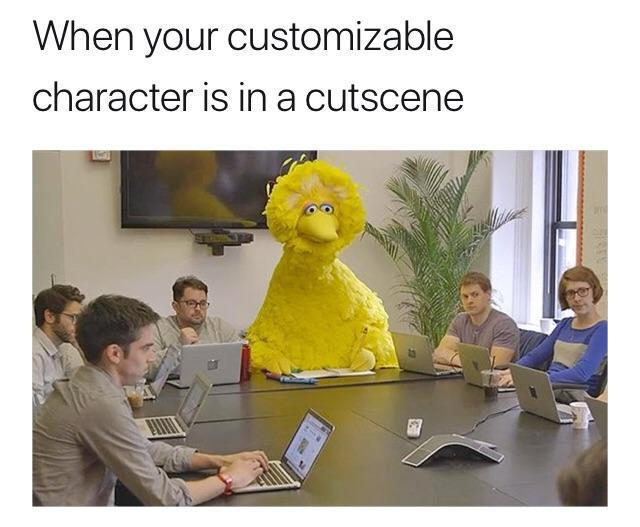
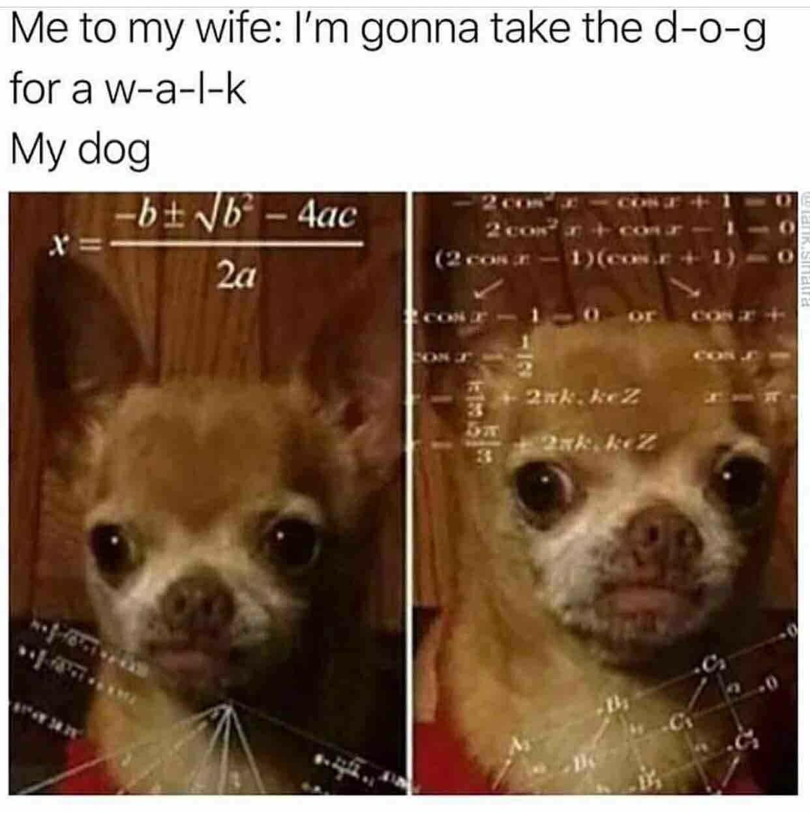
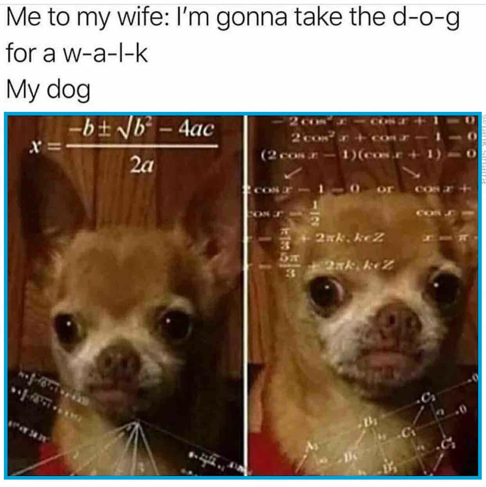
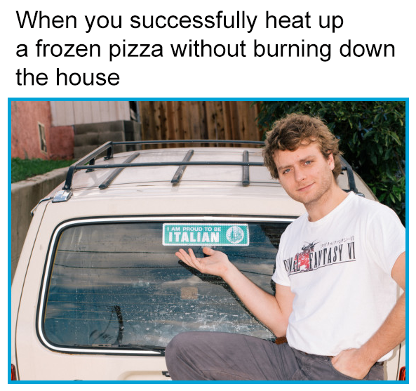
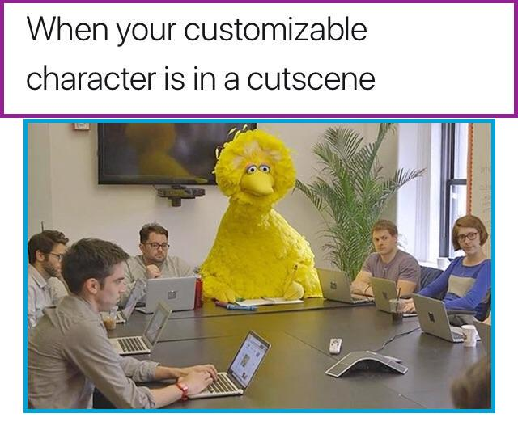
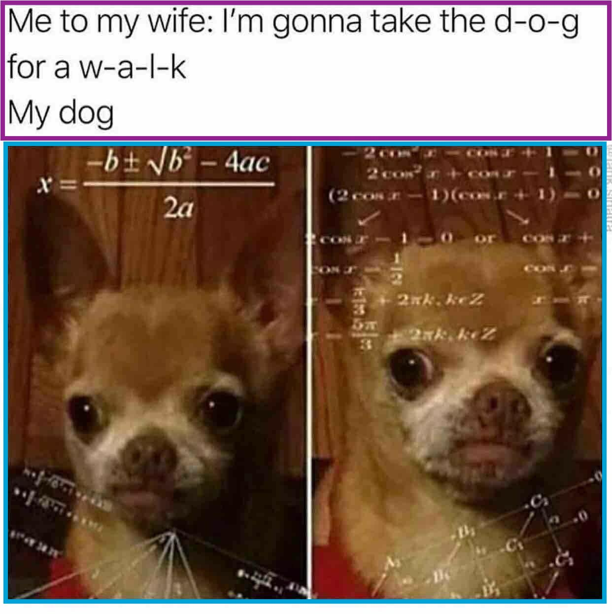
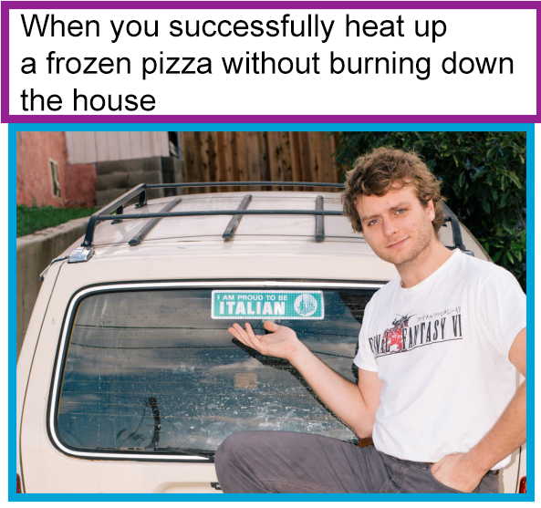
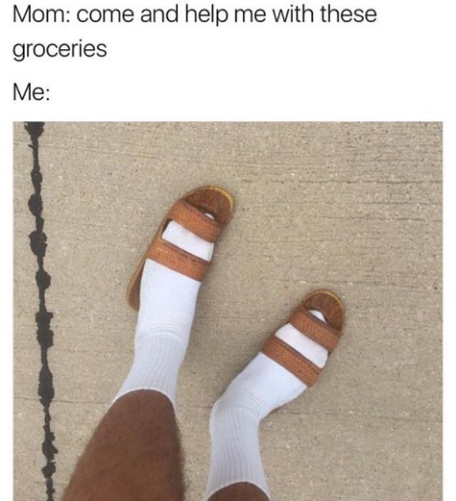

# meme-cropper 

The goal of this project is to automate the partitioning of a Twitter-screenshot meme into text and attachment components. 

## Motivation: 
The Twitter-screenshot meme is an image file that contains a text component and an attachment component, where the text component is a string of text that describes the attachment component. Below are some examples:



I will refer to the image below the text as an "attachment" as to avoid confusion with the entire image of the meme. 

For applications, we may want to analysis the contents of a meme. As examples, we may want to determine the language of the text, determine whose face is in the attachment, put the text through a spellcheck, or recycle the meme into a new format. Unfortunately, since the text and the attachment reside in a single image, it is difficult for computers to analysis them separately. So we may seek to partition the image into two new image files, an image for each component. 

To break the image down into its two components, we need to recognize the boundaries of the components and then crop.

The boundaries of the text component and the attachment component are variable so we cannot just hardcode in some boundaries and crop on the same boundaries everytime. We need to find the boundaries dynamically. 

One way to do this is to apply some computer vision and find the largest rectangular component, which is expected to be the attachment-component. Below are examples of the boundaries I was able to detect via the OpenCV computer vision library:



Once we know the boundaries of the attachment, we compute the boundaries of the text component as everything above the upper boundary of the attachment. 



## Getting Started

Install [OpenCV](https://opencv.org/). I followed [this guide](https://www.pyimagesearch.com/2016/12/19/install-opencv-3-on-macos-with-homebrew-the-easy-way/). 

Clone:
```git clone https://github.com/evmarts/meme-cropper.git```

Run the script:
```python meme-cropper.py```

### Prerequisites

- Python

## Built With

* OpenCV Python library

* Python Imaging Library (PIL)

## Examples

Suppose we have the following images stored in the ```in/``` directory:



We will run the Python script

~~~
evmarts$ python meme-cropper.py
Text component saved as: out/text/sample0text.jpg
Image component saved as: out/pic/sample0pic.jpg
Text component saved as: out/text/sample1text.jpg
Image component saved as: out/pic/sample1pic.jpg
...
Text component saved as: out/text/sample7text.jpg
Image component saved as: out/pic/sample7pic.jpg
~~~

The text components of the images are stored in the ```out/text/``` directory: 


and the attachment components are stored in the ```out/pics``` directory:


## Notes

When I ran this program against a batch on images, it was able to correctly crop 402  of the 500 images in 48 seconds. Although it misses some partitions, it saves me an enormous amount of time. 

## Authors

Evan Martin

## Acknowledgments

Adrian Rosebrock, [Building a Pokedex in Python: Finding the Game Boy Screen (Step 4 of 6)](https://www.pyimagesearch.com/2014/04/21/building-pokedex-python-finding-game-boy-screen-step-4-6/)

